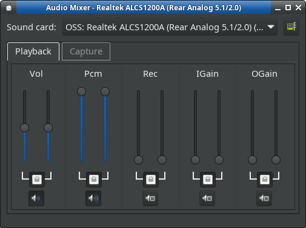

# GTK-Mixer

[](https://github.com/rozhuk-im/gtk-mixer/actions)
[](https://github.com/rozhuk-im/gtk-mixer/actions)


Rozhuk Ivan <rozhuk.im@gmail.com> 2020-2026

GTK-Mixer is GTK based volume control tool ("mixer").\
GUI from xfce4-mixer: https://gitlab.xfce.org/apps/xfce4-mixer
but xfce4 and gstreamer does not used.\
\
\


## Licence
GPL2 licence.


## Donate
Support the author
* **GitHub Sponsors:** [](https://github.com/sponsors/rozhuk-im) <br/>
* **Buy Me A Coffee:** [](https://www.buymeacoffee.com/rojuc) <br/>
* **PayPal:** [](https://paypal.me/rojuc) <br/>
* **Bitcoin (BTC):** `1AxYyMWek5vhoWWRTWKQpWUqKxyfLarCuz` <br/>


## Features
* plugins for support different sound backens
* change system default sound card
* set volume per line/channel
* enable/disable lines (mute/unmute)
* detect sound cards connect/disconnect
* detect default sound card change
* tray icon react on mouse wheel actions
* virtual_oss support


## virtual_oss
Default control device name is: ```/dev/vdsp.ctl```.\
To change it set env var:```OSS_VOSS_CTL_PATH``` with new value.


## Compilation

### Linux
```
sudo apt-get install build-essential git cmake libgtk-3-dev libasound2-dev fakeroot
git clone --recursive https://github.com/rozhuk-im/gtk-mixer.git
cd gtk-mixer
mkdir build
cd build
cmake -DCMAKE_BUILD_TYPE=Release -DCMAKE_VERBOSE_MAKEFILE=true ..
make -j 8
```

### FreeBSD/DragonFlyBSD
```
sudo pkg install devel/git devel/cmake-core x11-toolkits/gtk30
git clone --recursive https://github.com/rozhuk-im/gtk-mixer.git
cd gtk-mixer
mkdir build
cd build
cmake -DCMAKE_BUILD_TYPE=Release -DCMAKE_VERBOSE_MAKEFILE=true ..
make -j 8
```
